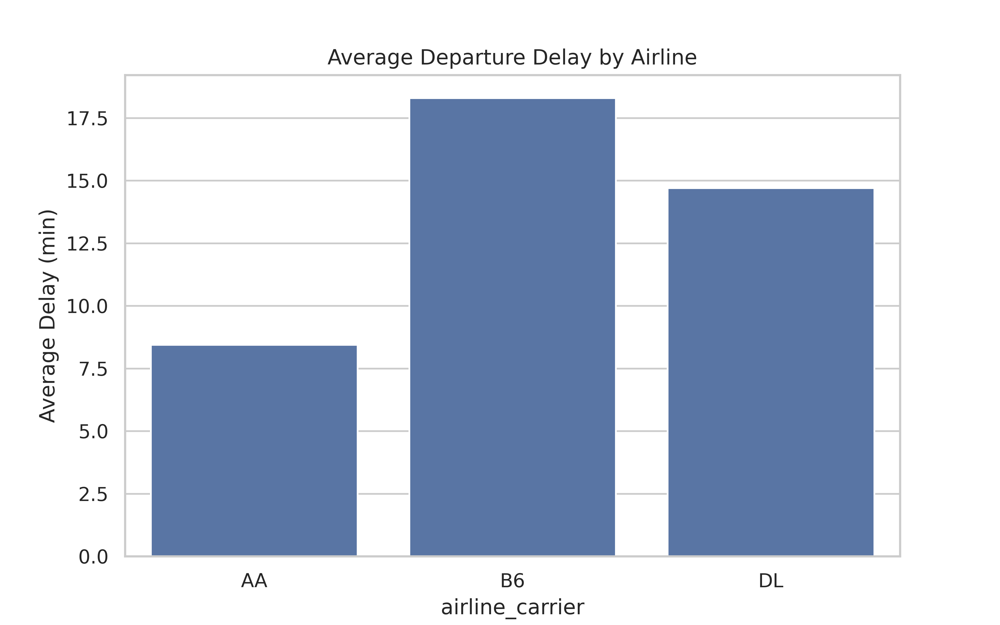
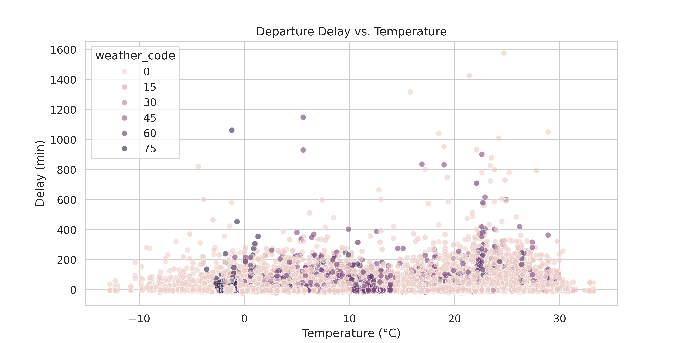
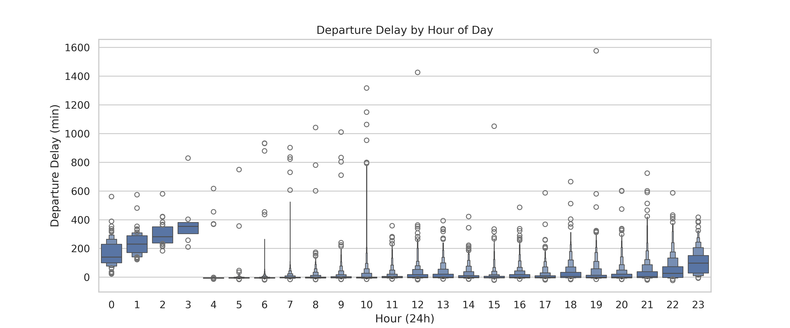
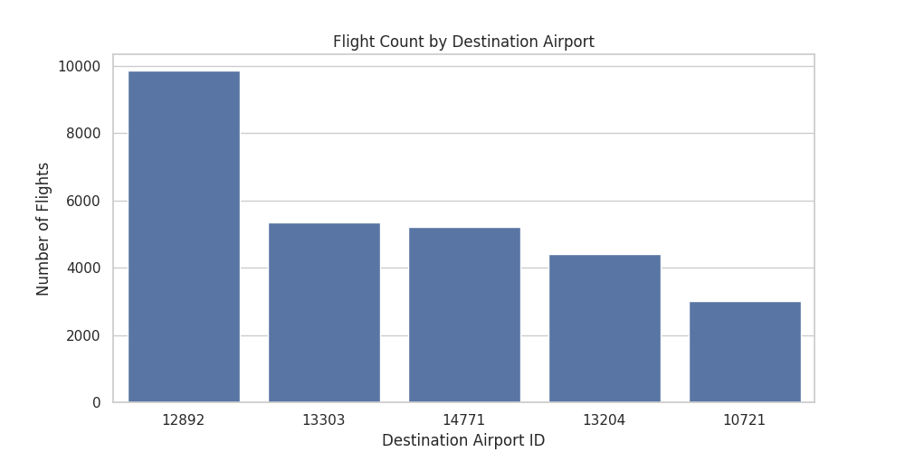

# flitepred

A Machine Learning project that aims to create a model that predicts flight delays based on data from the Bureau of Transportation Statistics (BTS) for flights from the JFK Airport in New York City for the whole year of 2024.

## Dataset

The dataset used for this project has been acquired from from the repository can be found at [The Bureau of Transportation Statistics Website](https://transtats.bts.gov/DL_SelectFields.aspx?gnoyr_VQ=FGJ&QO_fu146_anzr=b0-gvzr)

## Membership

Here is the membership information according to Destination Airports, and Airline Carriers in the data concerning flights from JFK, New York City.

Sure! Here's the **Membership** data formatted into neat tables:

### Top 5 Destination Airport IDs

| Rank | DEST_AIRPORT_ID       | Flights |
|------|-----------------------|---------|
| 1    | 12892 (LAX)           | 9,859   |
| 2    | 14771 (SFO)           | 6,385   |
| 3    | 10721 (BOS)           | 5,473   |
| 4    | 13303 (MIA)           | 5,356   |
| 5    | 13204 (MCO)           | 4,478   |

### Top 5 Airline Carriers

| Rank | OP_UNIQUE_CARRIER  | Flights |
|------|--------------------|---------|
| 1    | B6 (JetBlue)       | 35,345  |
| 2    | DL (Delta)         | 30,077  |
| 3    | YX (Republic)      | 16,846  |
| 4    | 9E (Endeavor)      | 16,517  |
| 5    | AA (American)      | 14,297  |

I have decided to filter the cleaned data first by the Top 5 Destination Airports, and then the Top 3 Airline Carriers, in interest of balanced data and a larger number of data points.

## Script Sequence

`append.py` -> `weather.py` -> `join.py` -> `clean.py` -> `filter.py` -> `rename.py`

`append.py`: To join all the monthly on-time performance CSVs and fuse it into a single one, while filtering by Origin Airport 12478 (JFK, NYC).

`weather.py`: Fetches hourly historical weather data from open-meteo for the coordinates of JFK, NYC.

`join.py`: Combines the two datasets using the hour part of departure time.

`clean.py`: Cleans the data to remove certain fields and add other ones (such as departure hour).

`filter.py`: To filter the cleaned data first by the Top 5 Destination Airports, and then the Top 3 Airline Carriers, in interest of balanced data and a larger number of data points.

`rename.py`: To rename the fields in the dataset in the interest of aesthetics and consistency.

## Visualizations

## Membership after filtering

### ✈️ Flights per Airline Carrier

| Airline Carrier | Number of Flights |
|-----------------|-------------------|
| B6              | 10,879            |
| DL              | 9,455             |
| AA              | 7,506             |

### 🛬 Flights per Destination Airport

| Destination Airport ID | Number of Flights |
|------------------------|-------------------|
| 12892                  | 9,859             |
| 13303                  | 5,352             |
| 14771                  | 5,216             |
| 13204                  | 4,412             |
| 10721                  | 3,001             |
